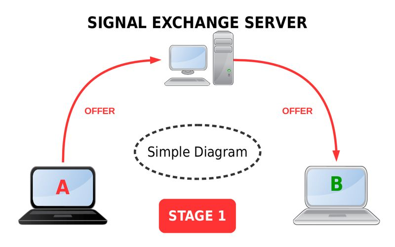
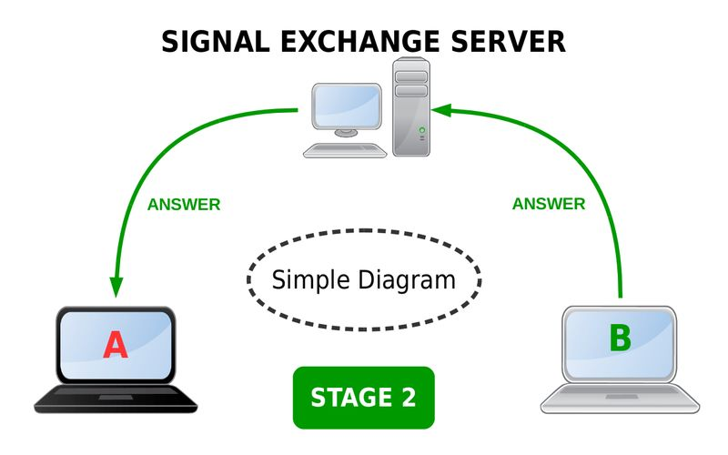
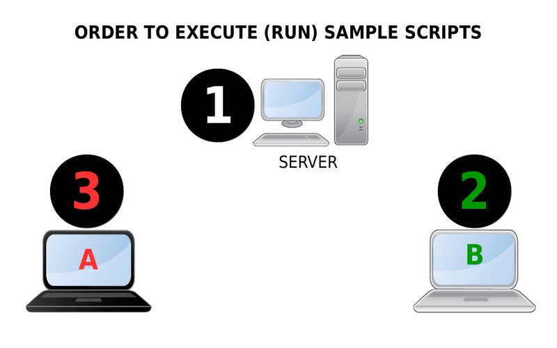
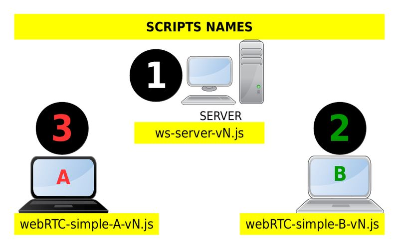
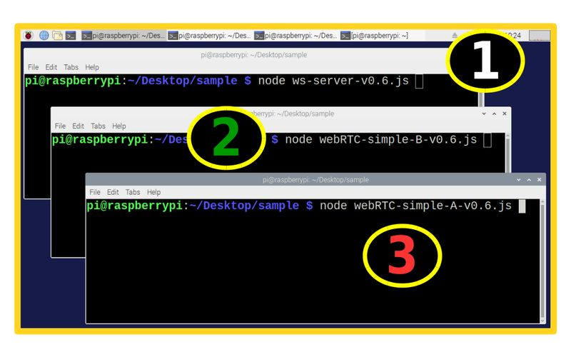
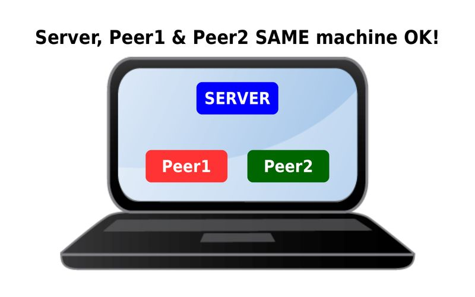
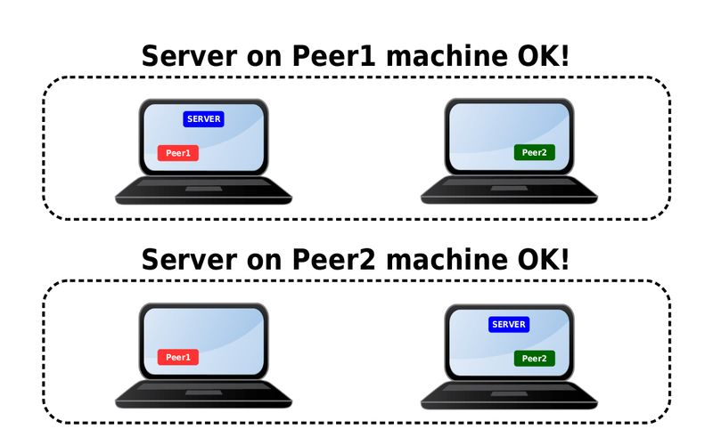
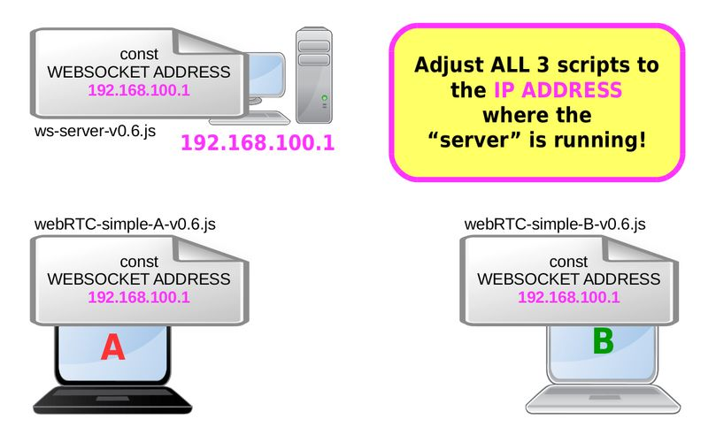

# WebRTC Easy and Power
**Web Real Time Communication - Easy and Powerful.**  
  
This sample intend to show WebRTC simplicity and powerfull mechanism.  
  
It uses NodeJS WebRTC and Simple-Peer Modules.  
  
The language of the scripts is JavaScript (NodeJS).  
  
My goal is to help common users to understand the basic of WebRTC, and start using it in, as much as possible, daily life stuff...  
  
  
First, let's do a little visual guide for the sample...  
  
Pict 1  
  
  
Pict 2  
  
  
Pict 3  
  
  
Pict 4  
  
  
Pict 5  
  
  
Pict 6  
  
  
Pict 7  
  
  
Pict 8  
  
  
Pict 9  
  
  
Pict 10  
  
  
Pict 11  
  

**How to:**  
0) Install the necessary software:  
```
npm install ws
npm install wrtc
npm install simple-peer
```
   
1) Download the .zip package and extract it  
  
2) Enter the directory:  
```
cd webRTC-easy-power   #Or, the name of the extracted folder...
```
  
3) run the server:  
```
node ws-server-v0.6.js   #Adjust for the correct version...
```
  
4) run the peer2 (B):  
```
node webRTC-sample-B-v0.6.js   #Adjust for the correct version...
```
  
5) run the peer1 (A):  
```
node webRTC-sample-A-v0.6.js
```
  
  
**Timming of the samples**  
For learning purposes, the samples uses the following time arrange.  
Second 1: exchange signals to connect  
Second 4: exchange messages  
Second 8: close connection(s)  
  
You can change the timming if you want.  
  
**Internet connection**  
You DO NOT NEED Internet connection, but, the computer need an IP ADDRESS otherwise the sample will not work properly...  
  
  
**2 Different Computers...IMPORTANT**  
You need to edit the scripts, and adjust the IP ADDRESS to reflect the ip addresses that you are running the server script!  
  
Take a look inside the code (all 3), all of them should point to the IP ADDRESS where the server-scripts is running.  
  
  
For RaspberryPI Zero, you need to compile Node-WRTC Module from source. [Instructions here...](https://github.com/t2age/webrtc-armv6)  
My advice is, test on x86 PC or RPI3 before trying on the Zero...  
    
  
**Here are the 3 small scripts**  
  
**ws-server-vN.js**  
```javascript
const WebSocket = require('ws');
const WebSocketServer = WebSocket.Server;

const WEBSOCKET_PORT = 9000;

//const WEBSOCKET_ADDRESS = "localhost";				// all on same machine, this is also the "ws-server.js"
const WEBSOCKET_ADDRESS = "127.0.0.1";				// all on same machine, this is also the "ws-server.js"
//const WEBSOCKET_ADDRESS = "192.168.200.200";			// use 2 machines, IP of the "ws-server.js"

// Create a server for handling websocket calls
const myWebSock = new WebSocket.Server({ port: WEBSOCKET_PORT, host: WEBSOCKET_ADDRESS })

var currentWebSocket = 0;


myWebSock.on('connection', function(ws) {	
	console.log('WebSocket Connection ON...');
	const symbolKey = Reflect.ownKeys(ws._sender._socket).find(key => key.toString() === 'Symbol(asyncId)')

	currentWebSocket = ws._sender._socket[symbolKey];
	console.log("Connection from client " + currentWebSocket);
	console.log()
	
	ws.on('message', function(message) {
		const symbolKey = Reflect.ownKeys(ws._sender._socket).find(key => key.toString() === 'Symbol(asyncId)')
		currentWebSocket = ws._sender._socket[symbolKey];		
			
		console.log('--------------------------------------------');
		console.log("Received from client " + currentWebSocket);
		console.log('Received: %s', message);
		console.log('--------------------------------------------');
		
		// Send the received msg to the other peer...
		myWebSock.sendToPeer(message, currentWebSocket);
    
	});
});


myWebSock.sendToPeer = function(data, clientOrigemID) {
	console.log("clientID " + clientOrigemID);

	this.clients.forEach(function(client) {

		const symbolKey = Reflect.ownKeys(client._sender._socket).find(key => key.toString() === 'Symbol(asyncId)')
		var clientDestinationID = client._sender._socket[symbolKey];
				
		if (client.readyState === WebSocket.OPEN) {
			// Send the msg to the other peer...
			if (clientDestinationID !== clientOrigemID) {
				console.log("    Sending to client " + clientDestinationID);
				client.send(data);
			} else {
				// This is the same peer that send the msg...
				console.log("    No need to send back to itself...");
			}
		}
	});
};


console.log('--------------------------------------------');
console.log('Server running. ws://' + WEBSOCKET_ADDRESS + ':' + WEBSOCKET_PORT );
console.log('--------------------------------------------');
console.log();

```
  
**webRTC-simple-A-vN.js**  
```javascript
var Peer = require('simple-peer')
var wrtc = require('wrtc')
var WebSocket = require('ws')


//const WEBSOCKET_ADDRESS = "localhost";        // all on the same machine, this is also the "ws-server.js"
const WEBSOCKET_ADDRESS = "127.0.0.1";				// all on same machine, this is also the "ws-server.js"
//const WEBSOCKET_ADDRESS = "192.168.200.200";      // use 2 machines, IP of the "ws-server.js"

var serverConn1;
serverConn1 = new WebSocket('ws://' + WEBSOCKET_ADDRESS + ':9000');
serverConn1.onmessage = gotMessageFromServer;

var peer1
peer1 = new Peer({ initiator: true, wrtc: wrtc })

function gotMessageFromServer(message) {
  var signal = JSON.parse(message.data);
  console.log('--> Received From Server:');
  console.log(signal.msg);  
  console.log();
  peer1.signal(signal.msg);
  
}


// connection/negotiation section...
peer1.on('signal', data => {
  // when peer1 has signaling data, send it to peer2
  try {
    setTimeout(function() {
      serverConn1.send( JSON.stringify({'msg': data}) )
    }, 250);
  } catch (err) {
    console.log(err)  
  }
  
})


// link is complete
peer1.on('connect', () => {
  // wait for 'connect' event before using the data channel
  setTimeout(function() {
    console.log('----------');
    console.log('----------');
    peer1.send('Hello Peer2!')
  }, 4000);
})


// data exchange section
peer1.on('data', data => {
  // got a data channel message
  console.log('Received message from Peer2: ' + data)
  
  if (data == 'closeItPlease#') {
    peer1.destroy()
    serverConn1.close()
  }
  
})


// shutdown section...
peer1.on('close', () => {
  console.log()
  console.log('Connection with Peer2 is closed...');
  console.log('----------');
  console.log('----------');  
})

```
  
**webRTC-simple-B-vN.js**  
```javascript
var Peer = require('simple-peer')
var wrtc = require('wrtc')
var WebSocket = require('ws')

//const WEBSOCKET_ADDRESS = "localhost";        // all on the same machine, this is also the "ws-server.js"
const WEBSOCKET_ADDRESS = "127.0.0.1";				// all on same machine, this is also the "ws-server.js"
//const WEBSOCKET_ADDRESS = "192.168.200.200";      // use 2 machines, IP of the "ws-server.js"

var serverConn2;
serverConn2 = new WebSocket('ws://' + WEBSOCKET_ADDRESS + ':9000');
serverConn2.onmessage = gotMessageFromServer2;

var peer2
peer2 = new Peer({ wrtc: wrtc })

function gotMessageFromServer2(message) {
  var signal = JSON.parse(message.data);
  console.log('--> Received From Server:');
  console.log(signal.msg);  
  console.log();
  peer2.signal(signal.msg);
}


// connection/negotiation section...
peer2.on('signal', data => {
  // when peer2 has signaling data, send it to peer1
  try {
    serverConn2.send( JSON.stringify({'msg': data}) )
  } catch (err) {
    console.log(err)  
  }

})


// link is complete
peer2.on('connect', () => {
  // wait for 'connect' event before using the data channel
  setTimeout( function() {
  console.log('----------');
  console.log('----------');
  }, 3000);
})


// data exchange section
peer2.on('data', data => {
  // got a data channel message
  console.log('Received message from Peer1: ' + data)
  
  peer2.send('Hello Peer1, how are you?')

  setTimeout( function () {
    peer2.send('closeItPlease#')
  }, 8000)
})


// shutdown section...
peer2.on('close', () => {
	console.log()
	console.log('Connection with Peer1 is closed...');
  serverConn2.close();
  console.log('----------');
  console.log('----------'); 
})

```
  
